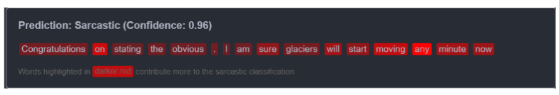

# 🎭 SarcGAN: Sarcasm Detection and Rewriting

[](https://python.org)
[](https://pytorch.org)
[](https://huggingface.co/transformers)
[](LICENSE)

> *"Oh great, another NLP project..."* → *"This is an impressive NLP project."*

**SarcGAN** is a state-of-the-art dual-module system that not only detects sarcasm with 78% accuracy but also transforms it into clear, literal language. Built with hybrid graph-transformer architecture and adversarial training, it's designed to tackle one of the most challenging problems in natural language understanding.

---

## 🚀 Quick Demo

<p align="center">
  
</p>

**Input:** *"Congratulations on stating the obvious. I'm sure glaciers will start moving any minute now."*

**Detection:** ✅ Sarcasm Detected (Confidence: 94.2%)

**Rewritten:** *"There is no need to state the obvious. Glaciers move very slowly."*

---

## 🎯 Why SarcGAN?

Sarcasm is everywhere on social media, but it's a nightmare for sentiment analysis algorithms. Consider these examples:

- *"Great job on being late!"* (Positive words, negative sentiment)
- *"Sure, let's ignore all evidence."* (Seemingly agreeable, actually dismissive)
- *"Your timing is absolutely perfect."* (Context-dependent meaning)

Traditional approaches fail because sarcasm requires understanding context, syntax, and cultural nuances simultaneously. SarcGAN solves this through:

🧠 **Hybrid Intelligence**: Combines transformer contextual understanding with graph-based structural reasoning  
🎨 **Style Transfer**: Uses adversarial training to naturally transform sarcastic tone  
🔍 **Interpretability**: Provides word-level importance analysis and attention visualization  

---

## 🏗️ Architecture Overview

<p align="center">
  
</p>

### 🔍 Detection Module: The Sarcasm Detector

Our detection system uses a novel hybrid approach that processes text through multiple complementary pathways:

<p align="center">
  
</p>

**1. Contextual Understanding (RoBERTa)**
- Processes raw text through transformer attention
- Captures semantic relationships and implicit meanings
- Generates 768-dimensional contextual embeddings

**2. Structural Analysis (Graph Neural Network)**
- Constructs unified graph from syntactic dependencies and word proximity
- Node features: 300D GloVe embeddings + 5D sentiment vectors (SenticNet)
- 4-layer GCN with progressive feature refinement: 305→64→128→128→64

**3. Sequential Processing (LSTM)**
- Captures temporal dependencies in node representations
- Bidirectional processing for complete context understanding
- Handles variable-length sequences with mean aggregation

**4. Intelligent Fusion (Attention Mechanism)**
- Dynamically weights transformer vs. graph representations
- Adapts to different types of sarcasm (lexical vs. structural)
- Final classification through fully connected layers

### 🎨 Rewriting Module: The Style Transformer

<p align="center">
  
</p>

**Generator (BART-based)**
- Encoder-decoder architecture for sequence transformation
- Trained to preserve semantic content while neutralizing sarcastic tone
- Uses beam search (width=10) for diverse output generation

**Discriminator (BERT-based)**
- Evaluates authenticity of transformed text
- Input: [CLS] original [SEP] transformed [SEP]
- Guides generator toward human-like transformations

**Adversarial Training**
- Generator Loss: `L_G = L_supervised + λ · L_adversarial`
- Discriminator Loss: `L_D = BCE(real_pairs, 1) + BCE(fake_pairs, 0)`
- Alternating optimization with gradient clipping for stability

---

## 📊 Performance Metrics

### Detection Results

<p align="center">
  
</p>

| Metric | Score | Benchmark |
|--------|-------|-----------|
| **Test Accuracy** | 78.10% | 🎯 |
| **F1-Score** | 78.49% | 🎯 |
| **Precision** | 77.43% | 🎯 |
| **Recall** | 79.58% | 🎯 |

### Training Progress

<p align="center">
  
</p>

| Epoch | Validation Accuracy | F1-Score | Improvement |
|-------|-------------------|----------|-------------|
| 1 | 79.57% | 80.31% | - |
| 2 | 83.02% | 82.44% | +3.45% |
| 3 | 85.20% | 85.04% | +2.18% |
| 4 | 85.98% | 86.15% | +0.78% |

### Confusion Matrix

<p align="center">
  
</p>

---

## 🎪 Rewriting Showcase

<p align="center">
  
</p>

| 😏 Sarcastic Input | 🎯 Literal Output | Context |
|-------------------|-------------------|---------|
| "Congratulations on stating the obvious." | "There is no need to state the obvious." | Dismissive praise |
| "Sure, let's ignore all evidence." | "It's not reasonable to ignore all evidence." | False agreement |
| "Your punctuality is truly inspiring." | "Being late is disappointing." | Ironic compliment |
| "Nice of you to show up three minutes late." | "It's not nice to be late." | Passive aggression |
| "I'm sure glaciers will start moving any minute now." | "Glaciers move very slowly." | Temporal sarcasm |

---

## 🔬 Deep Analysis & Interpretability

### Word-Level Impact Analysis

<p align="center">
  
</p>

Our analysis reveals fascinating patterns in how the model identifies sarcasm:

**Key Findings:**
- **"Congratulations"** + **"obvious"** creates the strongest sarcasm signal
- Word pairs like **"sure glaciers"** show higher impact than individual words
- Punctuation marks serve as crucial information aggregation points
- Context words amplify the effect of sarcasm markers

### Attention Flow Visualization

<p align="center">
  
</p>

The attention mechanism reveals how the model processes sarcastic text:
- Strong attention flows from sarcasm markers to context words
- Punctuation receives high attention from surrounding tokens
- Hierarchical structure with "Congratulations" and "sure" as anchors

### GCN Layer Evolution

<p align="center">
  
</p>

**Layer-by-Layer Analysis:**
- **Layer 1**: Initial feature extraction with uniform importance
- **Layer 2**: "Congratulations" emerges as key indicator
- **Layer 3**: Peak differentiation - critical for sarcasm detection
- **Layer 4**: Feature refinement while maintaining hierarchy

---

## 🧪 Technical Implementation

### Graph Construction Strategy

<p align="center">
  
</p>

```python
# Unified graph with dual edge types
def build_graph(text):
    # Node creation from dependency parsing
    nodes = extract_nodes_with_features(text)
    
    # Edge types
    window_edges = create_window_edges(nodes, window_size=2)
    dependency_edges = create_dependency_edges(nodes)
    
    # Feature integration
    node_features = concat([glove_embedding, senticnet_vector])
    
    return Graph(nodes, edges, features)
```

### Model Architecture Details

| Component | Specification | Purpose |
|-----------|---------------|---------|
| **Text Encoder** | RoBERTa-base (125M params) | Contextual understanding |
| **Graph Processor** | 4-layer GCN with BatchNorm | Structural reasoning |
| **Sequential Module** | Bidirectional LSTM (64 hidden) | Temporal dependencies |
| **Fusion Layer** | Attention mechanism | Feature combination |
| **Classifier** | FC layers with dropout | Final prediction |

### Training Configuration

<p align="center">
  
</p>

- **Datasets**: 1.3M Reddit comments + TV show dialogues (Mustard)
- **Optimization**: AdamW with gradient accumulation
- **Hardware**: GPU training with mixed precision
- **Evaluation**: Stratified train/test split with balanced classes

---

## 📈 Advanced Features

### 🎯 Attention Mechanism Insights

<p align="center">
  
</p>

Our attention analysis reveals three key patterns:
1. **Marker Attention**: Strong focus on words like "congratulations", "sure"
2. **Context Attention**: Attention flows to disambiguating context
3. **Structural Attention**: Punctuation and function words frame sarcasm

### 📊 Error Analysis

<p align="center">
  
</p>

**Common Failure Cases:**
- **Cultural References**: Sarcasm requiring world knowledge
- **Subtle Irony**: Minimal lexical cues
- **Multi-sentence**: Complex sarcastic structures
- **Domain-specific**: Technical or specialized contexts

### 🔍 Model Interpretability Tools

<p align="center">
  
</p>

**Available Visualizations:**
- Word importance heatmaps
- Attention flow networks  
- GCN layer evolution
- Prediction confidence scores
- Feature contribution analysis

---

## 🚀 Getting Started

### Quick Installation

```bash
git clone https://github.com/yourusername/sarcgan.git
cd sarcgan
pip install -r requirements.txt
```

### Basic Usage

```python
from sarcgan import SarcasmDetector, SarcasmRewriter

# Load pre-trained models
detector = SarcasmDetector.load_pretrained()
rewriter = SarcasmRewriter.load_pretrained()

# Detect sarcasm
text = "Great job on being late!"
is_sarcastic, confidence = detector.predict(text)

# Rewrite if sarcastic
if is_sarcastic:
    literal_text = rewriter.transform(text)
    print(f"Original: {text}")
    print(f"Rewritten: {literal_text}")
```

### Interactive Demo

<p align="center">
  
</p>

Try our interactive demo: [🔗 **SarcGAN Demo**](https://huggingface.co/spaces/your-space/sarcgan)

---

## 🎯 Future Roadmap

### 🔮 Planned Enhancements

- **Multimodal Detection**: Integrate audio and visual cues
- **Reinforcement Learning**: Optimize rewriting with human feedback
- **Hierarchical Graphs**: Scale to longer texts efficiently
- **Cross-lingual**: Extend to multiple languages
- **Real-time API**: Deploy as production-ready service

### 📊 Research Directions

- **Cultural Adaptation**: Handle region-specific sarcasm
- **Conversation Context**: Multi-turn dialogue understanding
- **Evaluation Metrics**: Better automatic quality assessment
- **Adversarial Robustness**: Defense against adversarial inputs

---

## 🤝 Contributing

We welcome contributions! Here's how you can help:

- 🐛 **Bug Reports**: Found an issue? Open an issue
- 💡 **Feature Requests**: Have an idea? We'd love to hear it
- 🔧 **Code Contributions**: Submit a pull request
- 📊 **Dataset Contributions**: Help improve our training data

---

## 📚 Citation

If you use SarcGAN in your research, please cite:

```bibtex
@article{sarcgan2025,
  title={SarcGAN: Sarcasm Detection and Rewriting using Graph Neural Networks and Adversarial Training},
  author={Patel, Umang and Goel, Sparsh and Patel, Sahil},
  journal={IIIT Hyderabad CS7.401 Project},
  year={2025},
  url={https://github.com/yourusername/sarcgan}
}
```

---

## 🙏 Acknowledgments

This work builds upon excellent research from:
- **Mohan et al. (2023)** - BERT + GCN foundation for sarcasm detection
- **Li et al. (2018)** - Delete-retrieve-generate text transformation concepts
- **Castro et al. (2019)** - Multimodal sarcasm datasets and benchmarks

Special thanks to the open-source community for providing the tools and datasets that made this research possible.

---

## 📄 License

This project is licensed under the MIT License - see the [LICENSE](LICENSE) file for details.

---

<p align="center">
  <strong>Built with ❤️ by Team 38 (The SUS) at IIIT Hyderabad</strong><br>
  <em>Introduction to NLP (CS7.401) - Spring 2025</em>
</p>

<p align="center">
  
</p>

---

*"Sarcasm is the lowest form of wit, but the highest form of intelligence."* - We're here to decode both! 🎭